# 기획안_v1.5

## **1. 주제 및 개요**

**지식그래프(KG) 기반 웨이퍼맵 결함 근본 원인 설명 Agent 시스템**
CNN 기반 웨이퍼맵 결함 패턴 분류와 VLM 기반 자연어 서술을 시작점으로, 현업 암묵지가 문서화된 지식그래프(KG)와 Fab 운영 데이터를 결합한 에이전트 추론을 통해 인스턴스 수준의 설명 가능한 Root Cause Analysis(RCA)를 수행하는 시스템. 결함은 공정, 장비, 공정 파라미터 등 다양한 요인의 상호작용으로 발생하므로, **온톨로지 기반 그래프를 활용해 원인 후보를 탐색**하고, **Hypothesis Agent(LLM 기반)와 Critic(규칙 기반 노드)이 실제 Fab 데이터를 근거로 원인 가설을 생성·검증**한다.

- 핵심 기능
    - WM-811K 공개 데이터와 도메인 문헌만으로, 웨이퍼맵 이미지를 입력받아 CNN이 결함 패턴을 분류하고, 그루핑 노드가 유사 패턴을 그룹화하면 VLM(API + few-shot)이 그룹별 패턴을 자연어로 서술한다.
    - Hypothesis 에이전트가 지식그래프(`kg_rca`)가 미리 결정적으로 순회해 찾아둔 공정 수준 원인 후보마다 검증등급(`[자동]`/`[반자동]`/`[근거없음]`)에 따라 정해진 MCP 도구를 조건부로 호출해 증거를 모으고, Critic 노드(규칙 기반)가 시간 정합성·반대 근거·근거 정합성(faithfulness)을 규칙으로 점검해 채택·기각하거나 근거가 부족하면 즉시 "판단 불가"를 반환한다.
    - 엔지니어가 하루 1회 배치를 트리거하면, 고정된 질문 템플릿("{패턴} 결함 패턴이 나타나는 근본 원인은 무엇인가요?") 기준으로 근거 있는 설명 카드를 생성한다.

---

## **2. 배경 및 문제정의**

- **산업 현황**
    - 공정 미세화와 고집적화로 실제 결함과 배경 노이즈의 구분이 어려워지고 가성 결함이 늘어나면서, 검출 이후의 정밀 검사와 분류, 원인 파악 단계가 병목이 된다.
    - 공정이 바뀔 때마다 규칙 기반 검사 레시피를 반복 조정해야 하는 부담도 크다.
- **기존 방식의 한계**
    - CNN 기반 결함 분류는 클래스별 대량 라벨이 필요하고, 새 결함 유형이나 공정 변화마다 잦은 재학습을 요구하며, 정적 라벨만 출력할 뿐 판단 근거를 남기지 못한다.
    - 특히 Center와 Local처럼 시각적으로 유사하지만 원인이 다른 패턴 구분에 약하다.
    - 이 때문에 결함을 서술하고 설명까지 하는 VLM(Vision Language Model) 기반 접근이 대안으로 부상하고 있다. 본 시스템은 CNN의 저비용·고속 분류와 VLM(API + few-shot)의 자연어 설명력을 함께 사용하여, CNN이 분류한 패턴을 그루핑한 뒤 VLM이 판단 근거가 되는 서술을 덧붙이는 방식으로 두 접근의 한계를 상호 보완한다.
- **현업의 문제**
    - 수율 엔지니어는 웨이퍼맵 패턴을 판독해 저수율 원인을 좁히지만, "무엇(what)"이 났는지는 알아도 "왜, 어디서(why, where)"로 이어지는 원인 연쇄는 **경험과 암묵지에 의존**한다.
    - **결함맵, 검사 결과, 정비 이력이 서로 다른 시스템에 흩어져 있어** 원인 규명에 있어 시간 소모가 크다.
- **멀티 에이전트 시스템의 필요성**
    - **현업 RCA**는 **단일 원인을 한 번에 짚는 것이 아니라, 여러 후보 가설을 동시에 세우고 각각을 증거로 검증하고 기각하는 과정**이다.
    - 이 경험과 암묵지는 트러블슈팅 표 등 문헌으로 문서화된 범위에 한해 지식그래프(KG)로 구조화한다. 동적 커뮤니티 요약을 수행하는 GraphRAG 기법 자체는 쓰지 않으며, 정적으로 구축된 문서화 KG를 결정적으로 순회·조회하는 방식이다.
    - 이 "가설의 병렬 탐색과 검증" 구조가 이 시스템의 핵심 설계 근거다. 시각 판독, 지식 검색, 가설 생성과 검증에서 성격이 다른 두 관심사(탐색/검증)를 분리한다.
    - Hypothesis 노드(LLM 기반 에이전트)는 "무엇을 더 조사할까"(탐색)를 맡아, 지식그래프가 빌드타임에 이미 결정적으로 찾아둔 복수 가설마다 검증등급(`[자동]`/`[반자동]`/`[근거없음]`)을 참고해 정해진 MCP 도구를 조건부로 호출해 증거를 모은다.
    - Critic 노드(규칙 기반)는 "이 답이 근거에 맞나"(검증)를 맡아 시간 정합성·반대 근거·faithfulness를 규칙으로 판정하고, 근거가 부족하면 재시도 없이 즉시 "판단 불가"를 반환한다.
    - 이 탐색과 검증의 역할 분리가 본 시스템의 핵심이며, Hypothesis는 LLM 기반 에이전트 노드로, Critic은 결정적 룰베이스 노드로 구현해 판단 근거를 항상 추적 가능하게 한다.
    - 벡터 RAG는 "무엇이 무엇을 유발했는가"라는 다중 홉 관계 추론에 취약하므로, 판독 결과를 조건으로 검색을 좁히는 지식그래프 검색이 두 노드의 공유 도구가 된다.
- *참고 자료 URL 첨부*
    - [https://developer.nvidia.com/blog/optimizing-semiconductor-defect-classification-with-generative-ai-and-vision-foundation-models/](https://developer.nvidia.com/blog/optimizing-semiconductor-defect-classification-with-generative-ai-and-vision-foundation-models/) (NVIDIA, 2025)
    - [https://arxiv.org/html/2604.27629v4](https://arxiv.org/html/2604.27629v4) (WaferSAGE, 2026)
    - [https://elec4.co.kr/contents/article_detail?article_idx=37189](https://elec4.co.kr/contents/article_detail?article_idx=37189) (AI 기반 검사 기술 동향, 2026)
    - Liao et al., "Wafer defect semantic reasoning via a three-stage retrieval-augmented system," Journal of Manufacturing Systems 85 (2026) (WaferDSR-RAG)
    - [https://news.skhynix.co.kr/seominsuk-column-test/](https://news.skhynix.co.kr/seominsuk-column-test/) (반도체 검사/테스트, SK하이닉스)

---

## **3. 타겟 사용자**

- 수율 향상(Yield) 엔지니어
    - 웨이퍼맵 결함 패턴을 판독해 저수율 원인을 좁히고 공정 개선을 이끄는 주체다.
    - 분석 결과는 공정기술 등 유관 부서에 전달한다.
- 대표 하루 업무 루틴
    - 09:00 전날 양산 웨이퍼 최종 검사 수율 데이터 로드, 저수율 로트 식별
    - 10:30 웨이퍼맵 결함 패턴 판독으로 우세 패턴과 공간 분포 파악
    - 11:00 통계/ML 파이프라인 가동, 수율 하락 원인 규명을 위해 피처 중요도 역추적
    - 13:30 결함 패턴과 원인을 도출해 공정기술 부서에 피드백 공유
    - 15:00 차기 모델 성능 튜닝 및 결측치 보정

---

## **4. 주요 기능**

| 순위 | 기능 | 설명 | 범위 (1. 최소구현/2. 가능하면 구현) |
| --- | --- | --- | --- |
| 1 | 지식그래프(KG) 기반 원인 후보 생성 (도구) | 판독된 결함 패턴(+VLM description)과 지식그래프를 기반으로 가능한 공정 원인 후보를 생성한다. | 1. 최소구현 |
| *→ 지식그래프는 CNN 분류 결과인 결함 유형과 VLM이 생성한 형상/공간에 대한 자연어 description을 시작 노드(검색 키)로 정의하고, 이와 연결 될 결함 메커니즘 (공정, 공정별 변수)을 문서 기반으로 구축. GraphRAG 같은 동적 커뮤니티 요약 기법은 쓰지 않으며, 문헌을 정적으로 구조화한 KG를 결정적으로 조회한다.* |  |  |  |
| 2 | Hypothesis 노드 (가설 검증, LLM 에이전트) | 지식그래프(`kg_rca`)가 결정적으로 미리 순회해 둔 원인 후보마다, 검증등급(`[자동]`/`[반자동]`/`[근거없음]`)을 참고해 정해진 MCP Tool(Commonality·Lot History·Telemetry·Alarm·Maintenance 등, 9종)을 조건부로 호출해 증거를 수집하고 가설별 Evidence를 구성한다. LLM 기반 에이전트 노드로 구현하며, 후보별 tool 호출 여부·순서를 에이전트가 추론해 결정한다. | 1. 최소구현 |
| 3 | Critic 노드 (검증, 규칙 기반) | Hypothesis 결과를 대상으로 시간 정합성, 정상 Lot 비교, 인과성, 증거 부족 여부를 결정적 함수(룰베이스)로 검증하여 가설을 채택·기각하거나, 채택 가능한 후보가 없으면 재시도 없이 즉시 "판단 불가(근거부족)"를 반환한다. LLM은 쓰지 않는다. | 1. 최소구현 |
| 4 | 웨이퍼맵 결함 패턴 판독 파이프라인 (도구) | 웨이퍼맵 이미지를 CNN이 결함 패턴(Center, Edge-Ring 등)으로 분류하고, 그루핑 노드가 유사 패턴을 그룹화한 뒤, VLM(API + few-shot)이 그룹별 대표 패턴의 공간/형상을 자연어 description으로 서술한다. | 1. 최소구현 |
| *→ WM 데이터 내 9가지 결함 유형 전체를 CNN 분류 대상으로 하되, KG~응답생성까지 끝까지 연결되는 건 Center/Edge-Ring/Scratch 3종뿐이다. 나머지 6종은 분류·서술까지만 지원하고 "원인 분석 데이터 없음"으로 명시한다.* |  |  |  |
| 5 | Root Cause 및 권장 조치 생성 | 최종 채택된 가설과 근거를 바탕으로 Root Cause와 권장 조치를 생성한다. | 1. 최소구현 |
| 6 | 인스턴스 수준 다중 홉 RCA | Fab 운영 데이터(FDC/MES/정비 이력) 부재 제약을 SECS/GEM 시뮬레이터 기반 합성 데이터로 대체하여 구현. 공정/장비 이력을 웨이퍼맵 데이터와 결합하여 제공하는 MCP 서버(9종 도구)를 구축하여, Hypothesis 노드의 가설 검증 도구로 연동. | 1. 최소구현 |
| 7 | cross-fab 일반화 평가 | 학습에 없던 분포(OOD, Out-Of-Distribution)의 웨이퍼맵에서 판독 견고성을 검증한다. | 2. 가능하면 구현 |
| 8 | 문서 작성 | 최종 결과를 리포트 형식으로 제작해준다. | 2. 가능하면 구현 |

---

## **5. 사례 조사 및 차별점**

#### **5.1 사례조사**

| 서비스명 | 개요 | URL |
| --- | --- | --- |
| WaferDSR-RAG | • 웨이퍼 결함을 위한 3단계 검색증강 시스템 |  |
| • 시각-의미 정렬, 결함 기반 지식 검색/선별, 지식 랭킹과 역할적응형 설명 생성 |  |  |
| • 이중모달 지식그래프(BWDKG) 사용 | Journal of Manufacturing Systems 85 (2026) |  |
| WaferSAGE | • 소형 VLM(Qwen3-VL-4B) 기반 웨이퍼 결함 VQA. 합성 데이터 생성과 루브릭 기반 강화학습으로 데이터 희소성 극복, 온프레미스 배포. | [https://arxiv.org/html/2604.27629v4](https://arxiv.org/html/2604.27629v4) |
| NVIDIA VLM/VFM 결함 분류 | • Vision Language Model(Cosmos Reason)과 Vision Foundation Model(NV-DINOv2)로 결함 분류 |  |
| • 설명가능성과 auto-labeling으로 유사 케이스 구분 | NVIDIA Developer Blog (2025) [https://developer.nvidia.com/blog/optimizing-semiconductor-defect-classification-with-generative-ai-and-vision-foundation-models/](https://developer.nvidia.com/blog/optimizing-semiconductor-defect-classification-with-generative-ai-and-vision-foundation-models/) |  |
| GraphRAG / LightRAG | • 지식그래프를 결합한 RAG로 다중 엔티티 관계와 도메인 제약 위의 논리 추론 지원 | Microsoft GraphRAG, LightRAG(2024) |
- 세부 내용
    - WaferDSR-RAG (2026)
        
        📌
        ▪ 반도체 제조 공정에서 Wafer defect detection의 일반화 및 해석 가능성 문제를 해결하기 위해 제안된 프레임워크
        ▪ 제안된 시스템은 Bimodal wafer defect knowledge graph(BWDKG)와 3단계 시맨틱 적응 전략을 통합하여, 시각적 정보와 도메인 지식을 결합한 맞춤형 설명을 생성
        ▪ 실험 결과, 기존의 딥러닝 및 LLM 기반 방법론들보다 뛰어난 검출 정확도와 실질적인 엔지니어링 통찰력을 제공
        
        - ▪ 반도체 제조 공정에서 Wafer defect detection의 일반화 및 해석 가능성 문제를 해결하기 위해 제안된 프레임워크
        - ▪ 제안된 시스템은 Bimodal wafer defect knowledge graph(BWDKG)와 3단계 시맨틱 적응 전략을 통합하여, 시각적 정보와 도메인 지식을 결합한 맞춤형 설명을 생성
        - ▪ 실험 결과, 기존의 딥러닝 및 LLM 기반 방법론들보다 뛰어난 검출 정확도와 실질적인 엔지니어링 통찰력을 제공
        - 기존 방식: Static visual classification (상단)
            - 작동 방식: 입력된 웨이퍼 맵을 CNN과 같은 딥러닝 모델에 통과시켜 특징(Feature map)을 추출
            - 출력 결과: 단순히 'Center', 'Donut', 'Loc' 등 결함의 종류를 Label-level output(0 또는 1로 표시되는 분류 결과) 형태로만 제공
            - 한계점: 결함의 원인에 대한 정보가 없고, 사용자의 역할이나 질문 의도와 관계없이 동일한 결과만 출력되므로 현장 엔지니어의 복잡한 요구사항을 충족하기 어려움
        - 제안 방식: WaferDSR-RAG (하단)
            - 입력 다양성: 웨이퍼 맵과 엔지니어의 질문 함께 입력
            - 시스템 구성: LLLM과 웨이퍼 결함 특화 지식을 결합하여, 3단계 전략 수행.
                - Stage 0 (input date processing):
                    - 시각적 데이터(웨이퍼맵)
                        - 사용자가 웨이퍼 맵 이미지를 업로드하면, Pre-trained DCN(Deformable Convolutional Network)이 이미지 처리
                        - DCN이 웨이퍼 맵의 복잡한 공간적 특징(예: Center, Edge-Ring 등)을 추출하여 벡터로 변환 (이미지를 컴퓨터가 이해할 수 있는 수치 데이터로 압축)
                    - 텍스트 데이터 (사용자 질의)
                        - LLM으로 분석해 '질문 의도'와 '핵심 키워드'를 파악
                - Stage 1 (Visual-semantic alignment): 웨이퍼 맵의 시각적 결함 정보와 지식 그래프를 의미론적으로 연결 (웨이퍼맵 이미지는 DCN(Deformable Convolutional Network)으로 처리)
                    - 지식 그래프에 각 결함 유형의 이미지 프로토타입 저장된 상태
                    - stage 0에서 추출된 웨이퍼맵 이미지 벡터와 지식 그래프 프로토타입의 코사인 유사도 계산
                - Stage 2 (Potential defect-based knowledge retrieval and filtering): 결함과 관련된 도메인 지식만을 정확히 검색하고 필터링
                - Stage 3 (Knowledge ranking and role-adaptive explanation generation): 검색된 지식을 중요도 순으로 랭킹을 매기고, 질문자의 역할에 맞춰 최적화된 설명을 생성
                    - 시스템은 추출된 결함 유형과 사용자의 질문 키워드를 조합
                    - 지식 그래프에서 검색된 관련 지식(예: "Center 결함은 Thin-film deposition 문제와 관련됨")을 텍스트로 바꿔, 사용자의 원래 질문과 함께 LLM 입력 프롬프트로 합침
            - 결과: 각 엔지니어의 직무에 따라 서로 다른 수준과 관점의 Role-adaptive output(품질 엔지니어에겐 결함 유형, 공정 엔지니어에겐 발생 원인, AI 엔지니어에겐 추천 모델)을 제공
    - WaferSAGE (2026)
        
        📌
        ▪ 반도체 웨이퍼 결함 분석을 위해 데이터 부족 문제를 해결하는 3단계 합성 파이프라인과 루브릭 기반의 강화학습 프레임워크를 제안
        ▪ 제안된 프레임워크는 Qwen3-VL-4B 모델을 활용하여 전문적인 결함 식별, 공간 분포 및 근본 원인 분석에서 우수한 성능을 달성하며, 대형 모델에 필적하는 정확도를 구현
        ▪ 산업 특화 데이터와 루브릭 기반 보상 최적화를 통해 소규모 Vision-Language Model로도 고도의 시각적 이해가 가능함을 입증하여, 개인정보 보호가 중요한 반도체 제조 현장에 효과적인 온프레미스 배포 경로를 제시
        
        - ▪ 반도체 웨이퍼 결함 분석을 위해 데이터 부족 문제를 해결하는 3단계 합성 파이프라인과 루브릭 기반의 강화학습 프레임워크를 제안
        - ▪ 제안된 프레임워크는 Qwen3-VL-4B 모델을 활용하여 전문적인 결함 식별, 공간 분포 및 근본 원인 분석에서 우수한 성능을 달성하며, 대형 모델에 필적하는 정확도를 구현
        - ▪ 산업 특화 데이터와 루브릭 기반 보상 최적화를 통해 소규모 Vision-Language Model로도 고도의 시각적 이해가 가능함을 입증하여, 개인정보 보호가 중요한 반도체 제조 현장에 효과적인 온프레미스 배포 경로를 제시
        - 핵심 4단계 구성 요소
            - 1단계: 데이터 큐레이션
                - 목적: 원본 데이터의 노이즈(잘못된 라벨링)를 제거하여 고품질 학습 데이터를 확보
                - 과정: ViT를 사용하여 웨이퍼 맵의 임베딩을 추출한 뒤, t-SNE와 K-Means 클러스터링을 통해 비슷한 패턴끼리 묶어 분류. 이를 통해 신뢰도 높은 샘플만을 정제하여 다음 단계로 넘김
            - 2단계: 3단계 합성 파이프라인
                - 목적: 라벨이 부족한 데이터에 전문적인 설명을 더해 VQA학습용 데이터셋을 생성
                - 과정:
                    - IMG → Text: Gemini 3 Flash을 활용해 웨이퍼 맵의 공간적 특징과 근본 원인을 설명하는 텍스트를 생성
                        - Gemini 3 Flash 사용 이유
                            
                            ```
                              1. 고품질의 도메인 특화 지식 추출
                            
                              복잡한 반도체 웨이퍼 맵을 보고 그 형태(Morphology), 공간적 분포(Spatial Distribution), 그리고 잠재적인 공정상의 문제(Root Cause)를 정확하고 풍부하게 묘사할 능력을 갖추고 있다
                            ```
                            
                            - 1. 루브릭 생성을 위한 '기준점(Teacher Model)' 역할
                            
                            ```
                              Qwen3-4B의 Teacher Model로서, 루브릭 생성을 위한 '기준점(Teacher Model)' 역할
                            
                              - 학습 모델인 Qwen3-4B(소형 모델)가 스스로 루브릭을 만들 수 없음
                              - 따라서 Gemini 3 Flash와 같은 상위 모델이 먼저 고품질의 분석 텍스트를 작성하고, 이를 바탕으로 구조화된 루브릭(필수 키워드 및 금지 키워드 포함)을 도출하게 함으로써 '전문가의 지식'을 소형 모델에게 주입하는 정답지(Ground Truth) 역할을 수행
                            ```
                            
                            - 1. 비용 효율적
                            - Gemini 3 Flash가 최상위 모델보다 비용 효율성과 처리 속도 면에서 더 나은 성능-가격비를 제공한다고 판단
                            - 데이터 합성 단계는 수만 장의 데이터를 처리해야 하므로 많은 API 비용이 발생
                            - Gemini 3 Flash는 대규모 데이터 합성을 위한 합리적인 비용으로도 충분히 높은 수준의 추론과 설명 능력을 보여주기 때문에, 고품질 데이터셋을 구축하기 위한 최적의 '교사 모델'로 선택
                            - 교사 모델인 Gemini 3 Flash가 생성한 설명에 오류가 있을 경우, 이를 필터링하거나 검증하는 논리적 장치는?
                                - 교사 모델(Gemini 3 Flash)이 생성할 수 있는 데이터 오류나 환각 현상을 최소화하고, 고품질 데이터만을 선별하기 위해 다중 검증 시스템을 사용
                                    1. 클러스터링 기반의 데이터 필터링: ViT 임베딩 & K-Means 클러스터링
                                    2. 루브릭 기반의 자동 검증: 교사 모델이 생성한 텍스트를 구조화된 루브릭으로 다시 한 번 변환
                                    3. 다중 모델 간의 교차 확인: DeepSeek-V3.2와 같은 다른 모델을 활용하여, Gemini가 분석한 내용을 DeepSeek가 루브릭 형식으로 정제 및 변환하는 단계를 별도로 둠. 이 과정에서 두 모델 간의 의견 불일치가 발생하거나 루브릭 변환 단계에서 정보의 일관성이 깨지면 해당 데이터는 학습에서 제외하는 논리적 필터링을 적용.
                                    4. 수동 검증으로 보완……
                                        
                                        데이터셋 구축 후, 테스트 셋은 Gemini 3 Flash의 출력물을 그대로 쓰지 않고 전문 엔지니어에 의한 수동 검증을 거침…... 이를 통해 핵심적인 평가 기준(Ground Truth)의 신뢰도를 확보…………
                                        
                    - Text → Rubric: 생성된 텍스트를 기반으로 평가 기준표(Rubric) 구축. 여기에는 반드시 포함되어야 할 'Must-hit' 키워드와 피해야 할 'Must-avoid' 키워드가 정의
                    - Rubric → VQA: 이 루브릭을 가이드라인 삼아 모델이 학습할 구체적인 질의응답 쌍을 자동으로 생성
            - 3단계: 학습 파이프라인
                - 목적: Qwen3-4B-VL 모델을 반도체 도메인에 특화된 전문가로 학습
                - 과정:
                    - SFT (Supervised Fine-Tuning): LoRA 기법을 사용해 효율적으로 모델을 미세 조정
                    - RL (Reinforcement Learning): GSPO 알고리즘과 커리큘럼 학습을 적용. 특히, 앞서 생성한 루브릭이 보상(Reward) 모델의 기준이 되어, 모델이 더 정교하고 정확한 분석 결과를 내놓도록 강화학습을 진행
            - 4단계: 평가
                - 목적: 학습된 모델의 성능을 자동화된 방식으로 엄격하게 측정
                - 과정:
                    - Rule-Based: 미리 정의된 루브릭 키워드 준수 여부를 바탕으로 정량적 점수 산출
                    - LLM-Judge: 고성능 LLM이 답변의 논리성과 정확성을 평가. 최종적으로 두 평가 방식의 결과를 조합하여 최종 성능 지표를 산출
    - NVIDIA VLM/VFM 기반 결함 분류
        
        📌
        ▪ NVIDIA Metropolis 비전 언어 모델(VLM), 비전 기반 모델(VFM) 및 NVIDIA TAO 툴킷을 활용한 생성형 AI 기반 자동 결함 분류는 레이블링된 데이터 요구량을 줄이고, 재학습을 최소화하며, 의미론적 추론을 가능하게 함으로써 기존 CNN 방식의 한계를 극복
        ▪ NVIDIA VLM인 Cosmos Reason은 소량 데이터 학습, 해석 가능한 자연어 출력, 대화형 질의응답, 자동 라벨링, 시계열 분석을 통해 웨이퍼 수준의 결함 분류를 지원하며, 웨이퍼 맵에 대한 미세 조정을 통해 96% 이상의 정확도를 입증
        ▪ NVIDIA VFM인 NV-DINOv2는 방대한 레이블 없는 데이터셋을 활용한 자기지도 학습, 도메인 적응, 다운스트림 미세 조정을 통해 다이 레벨 결함 감지 작업에서 최대 98.51%의 정확도를 달성하는 동시에 수동 주석 작업의 필요성을 대폭 줄이고 NVIDIA TensorRT 및 DeepStream을 사용한 최적화된 배포를 지원
        
        - ▪ NVIDIA Metropolis 비전 언어 모델(VLM), 비전 기반 모델(VFM) 및 NVIDIA TAO 툴킷을 활용한 생성형 AI 기반 자동 결함 분류는 레이블링된 데이터 요구량을 줄이고, 재학습을 최소화하며, 의미론적 추론을 가능하게 함으로써 기존 CNN 방식의 한계를 극복
        - ▪ NVIDIA VLM인 Cosmos Reason은 소량 데이터 학습, 해석 가능한 자연어 출력, 대화형 질의응답, 자동 라벨링, 시계열 분석을 통해 웨이퍼 수준의 결함 분류를 지원하며, 웨이퍼 맵에 대한 미세 조정을 통해 96% 이상의 정확도를 입증
        - ▪ NVIDIA VFM인 NV-DINOv2는 방대한 레이블 없는 데이터셋을 활용한 자기지도 학습, 도메인 적응, 다운스트림 미세 조정을 통해 다이 레벨 결함 감지 작업에서 최대 98.51%의 정확도를 달성하는 동시에 수동 주석 작업의 필요성을 대폭 줄이고 NVIDIA TensorRT 및 DeepStream을 사용한 최적화된 배포를 지원
        - VLM → 웨이퍼 맵 이미지 분류 (추가 학습을 통해 VLM은 다이 레벨 검사에서도 뛰어난 잠재력 보임)
        - VFM → 광학 현미경, 전자빔 현미경, 후처리 광학 현미경 검사 데이터를 포함한 다이 레벨 이미지 분류
        - 웨이퍼 맵은 웨이퍼 전체에 걸쳐 결함 분포를 공간적으로 보여줌
        - VLM은 고급 이미지 이해 기능과 자연어 추론 기능을 결합
        - NVIDIA 추론 VLM (예: Cosmos Reason )은 미세 조정을 거쳐
            - 웨이퍼 맵 이미지를 해석하여 거시적 결함을 식별하고,
            - 자연어 설명을 생성하고, 대화형 질의응답을 수행하고,
            - 테스트 이미지를 골든 참조 이미지와 비교하여 초기 근본 원인 분석을 수행
        - 이점
            - 소량 데이터 학습:
                
                VLM은 적은 수의 레이블이 지정된 예제만으로도 정밀하게 조정할 수 있으므로 새로운 결함 패턴, 공정 변경 또는 제품 변형에 신속하게 적응 가능
                
            - 설명 가능성:
                
                그림에서 보는 것처럼, Cosmos Reason은 엔지니어가 자연어를 사용하여 상호 작용할 수 있는 해석 가능한 결과를 생성
                
                예를 들어,
                
                *"이 웨이퍼 맵에서 주요 결함 패턴은 무엇입니까?" 라고 질문하면 "중심 링 결함이 감지되었으며, 화학적 오염 때문일 가능성이 높습니다."*
                
                와 같은 결과가 반환될 수 있음. 이러한 의미론적 추론 능력은 CNN을 뛰어넘어 엔지니어가 잠재적인 근본 원인을 신속하게 파악하고, 시정 조치를 가속화하며, 수동 검토량을 줄이는 데 도움을 줌.
                
            - 자동 데이터 라벨링:
                
                VLM은 하위 ADC 작업에 필요한 고품질 라벨을 생성하여 모델 개발 시간과 비용 절감 가능.
                
                실제로 이 접근 방식은 수동 라벨링 워크플로에 비해 모델 구축 시간을 최대 2배까지 단축할 수 있음.
                
            - 시계열 및 로트 수준 분석:
                
                VLM은 정지 이미지와 비디오 시퀀스를 모두 처리할 수 있어 시간 경과에 따른 공정 이상을 사전에 모니터링하고 치명적인 오류로 이어지기 전에 문제를 해결할 수 있음.
                
                한 연구에서 VLM은 정상 및 불량 사례 모두에서 높은 정확도를 달성하여 기존 CNN 기반 방식보다 우수한 성능을 보임.
                
        - 해당 워크플로우에 대한 자세한 설명은 데이터 전처리 수행 시 공유

#### **5.2 차별점**

**지식그래프(KG)와 Fab 데이터를 결합한 Root Cause Analysis**

- 문헌 기반 원인 후보(문서화 KG)와 실제 Fab 운영 데이터(Lot History, Telemetry, Alarm, Maintenance)를 함께 활용하여 근본 원인을 검증한다.

**MCP 기반 Tool 아키텍처**

- Fab 데이터를 표준화된 Tool Interface(MCP)로 조회하여 노드와 데이터 접근을 분리했으며, 향후 실제 MES/FDC 데이터로도 쉽게 확장 가능하다.

**실제 반도체 RCA 업무 절차를 반영**

- 결함 판독 → 원인 후보 생성 → 증거 수집 → 가설 검증 → 최종 Root Cause 도출이라는 현업 RCA 프로세스를 AI 파이프라인으로 구현하였다.

**공개 데이터만으로 재현 및 검증**:

- WM-811K와 도메인 문헌만 사용해 Fab 내부 데이터 없이 구현하고, 온프레미스로 이미지 외부 유출 없이 배포한다.

**탐색과 검증의 노드 분리**:

- Hypothesis 노드(LLM 기반 에이전트)가 지식그래프(`kg_rca`)가 이미 결정적으로 찾아둔 복수 가설 각각에 검증등급을 참고해 증거를 수집하고, Critic 노드(규칙 기반)가 근거 정합성을 규칙으로 검증하는 구조로, 경로를 한 번 찾고 끝나는 단일 파이프라인과 차별화된다.
- **환각 억제**:
    - Critic의 faithfulness 점검(규칙 기반)으로 근거가 없으면 "판단 불가"를 반환한다.
- **확장 가능한 스키마**:
    - 인스턴스 수준 RCA(장비/센서/정비)로 자연스럽게 확장되도록 그래프를 설계했다.

---

## **6. 활용 데이터**

**6.1 웨이퍼맵 데이터 (WM-811K)**

- 실제 팹에서 수집된 약 172,950장의 라벨링된 웨이퍼맵
- 9개 패턴(Center, Donut, Edge-Loc, Edge-Ring, Loc, Near-Full, Scratch, Random, None)을 포함하고 있으나, 본 프로젝트에서는 그 중에서도 가장 기본적인 결함 패턴인 "Center", "Edge-Ring", "Scratch"만 다룬다. 그 이외의 6개 패턴은 "새로운 결함 패턴"으로 가정한다.
- in-distribution 학습/검증과 cross-fab OOD 평가로 분할한다
    
    (출처: Wu et al., IEEE Trans. Semiconductor Manufacturing 2014; Kaggle 공개)
    
- 결함 패턴(Center, Edge-Ring, Scratch 등) 판독을 위한 CNN 분류 입력, 그리고 그루핑 노드가 묶은 그룹의 대표 이미지는 VLM(API + few-shot) description 생성 입력으로 활용

**6.2 지식그래프(KG) — 현업 암묵지의 문서화**

- 반도체 제조 교재, 공정 매뉴얼, 결함 분석 논문 등 신뢰성 있는 도메인 문헌을 활용한다. 엔지니어의 경험/암묵지 중 트러블슈팅 표 등으로 이미 문서화된 부분을 대상으로 하며, GraphRAG류의 동적 커뮤니티 요약·검색 기법은 사용하지 않는다.
- RCA에 필요한 공정, 장비, 결함 패턴, 공정 파라미터, 원인 및 영향 관계를 중심으로 온톨로지를 정의하고, LLM으로 엔티티·관계를 1차 자동 추출해 스키마에 맞게 정적으로 구조화한다. 이렇게 구축된 KG는 빌드타임에 결정적으로 순회를 마치고, 런타임에는 조회만 한다.
- 그래프 스키마: `DefectPattern(고정 3종: Center/Scratch/Edge-Ring) → ProcessStep(고정 6종) → FailureMode → Cause → Evidence(:Parameter|:Maintenance|:Recipe)`. `DefectPattern`/`ProcessStep`/`Parameter`만 고정 vocabulary로 매핑하고 `FailureMode`/`Cause`/`Maintenance`/`Recipe`는 문헌에서 LLM이 자유 추출한다. `DefectPattern` 검색 키는 CNN 분류 라벨과 VLM이 생성한 자연어 description을 함께 사용한다.
- 구현·실행 완료: 문헌 5편 → 청크 95개 → 가설 **125건**(Center 62 / Edge-Ring 53 / Scratch 10). 가설마다 검증등급 `[자동]`/`[반자동]`/`[근거없음]`을 부여하며, 기준은 "fab.db에 데이터가 있느냐"가 아니라 "결정적 조인 키 + 판정 규칙으로 자동 채택/기각까지 갈 수 있느냐"다.
- WM-811K 9개 패턴 중 이 그래프까지 연결되는 건 **Center/Edge-Ring/Scratch 3개**뿐이며, 나머지 6개는 원인 매핑 대상이 아니다.
- 원문 대비 추출 정확성과 관계의 논리적 일관성은 저장 전에 검증 규칙(신뢰도 필터, 앵커 정규화, grounding 가드, 국소성, 공정-변수 정합성, 고아 제거 6종)으로 걸러낸다.

| 종 | 문서명 | 설명 | 참조 |
| --- | --- | --- | --- |
| 도서 | 반도체 소자 공정기술 (영문판) | 반도체 제조 공정, 장비, 공정 변수 및 결함 메커니즘을 체계적으로 설명하는 반도체 제조 분야의 대표적인 기초 교재. 트러블슈팅 표(공정별 고장모드→원인→조치)를 실제 KG 구축에 사용. | Quirk, M., & Serda, J. (2001). *Semiconductor manufacturing technology* (Vol. 1). Upper Saddle River, NJ: Prentice Hall. |
| 논문 | Wafer defect semantic reasoning via a three-stage retrieval-augmented system in semiconductor manufacturing. | 웨이퍼맵과 자연어 질의를 함께 입력받아 결함 유형뿐 아니라 공정 원인과 역할별(품질·공정·AI 엔지니어) 설명까지 생성하는 GraphRAG 계열 선행 연구. KG 추출 프롬프트 설계와 사례조사(§5)에 참조. | Liao, X., Zhang, J., Lyu, Y., & Wang, J. (2026). Wafer defect semantic reasoning via a three-stage retrieval-augmented system in semiconductor manufacturing. *Journal of Manufacturing Systems*, *85*, 269-286 |
| 현업 암묵지 | 인터뷰 내용 |  |  |

실제 KG에 적재된 문헌은 위 교재 1종 외에 패턴→공정 산문 문서 3종, 원인 직결형 논문 표 1종을 포함해 총 5편이다.

**6.3 Fab 운영 데이터(fab.db)**

- 실제 MES/FDC 구조를 참고하여 합성한 SQLite 데이터베이스
- Hypothesis 노드가 원인 가설을 검증하기 위한 인스턴스 데이터
- fab.db를 직접 조회하지 않고 MCP Tool을 통해 접근

## **주요 테이블 :**

```mermaid
erDiagram
    LOT ||--o{ wafer          : "has  (lot_id)"
    LOT ||--o{ lot_history    : "traverses  (lot_id)"
    EQUIPMENT ||--o{ lot_history  : "processed at  (equipment_id)"
    EQUIPMENT ||--o{ telemetry    : "emits  (equipment_id + time window)"
    EQUIPMENT ||--o{ maintenance  : "serviced  (equipment_id)"
    EQUIPMENT ||--o{ alarm        : "raises  (equipment_id)"
    LOT ||--o{ alarm          : "optional  (lot_id, nullable)"
    EQUIPMENT ||--o{ metric_series : "scope = equipment_id"
    EQUIPMENT ||--o{ event_log     : "scope = equipment_id"

    LOT {
        TEXT lot_id PK "개념적 — 물리 테이블 없음"
    }

    EQUIPMENT {
        TEXT equipment_id PK "fab_model.yaml 정의, DB 테이블 아님"
        TEXT step_group "LITHO/ETCH/DEPO/CMP/CLEAN/EDS"
        TEXT chambers "인스턴스별 챔버 목록"
        TEXT normal_ranges "파라미터 정상범위 (query_telemetry가 조회)"
    }

    wafer {
        TEXT source "wm811k"
        TEXT lot_id PK "join key"
        TEXT wafer_id PK
        BLOB die_map "np.save 바이트(2D uint8). 배경 lot은 NULL"
        REAL die_size
        INT  is_normal
    }

    lot_history {
        TEXT lot_id "join key → LOT"
        TEXT step "route 6스텝 중 하나"
        TEXT equipment_id "join key → EQUIPMENT"
        TEXT chamber
        TEXT recipe_id
        TEXT ts_in "처리 시작"
        TEXT ts_out "처리 종료 (telemetry 시간창)"
    }

    telemetry {
        TEXT equipment_id "join key → EQUIPMENT"
        TEXT ts "2시간 간격"
        TEXT param "rf_power, flow_rate ..."
        REAL value
    }

    alarm {
        TEXT equipment_id "join key → EQUIPMENT"
        TEXT lot_id "nullable — 교란 알람은 NULL"
        TEXT ts
        INT  alarm_id "교란 1000번대 / 지지 3000번대"
        TEXT text
    }

    maintenance {
        TEXT equipment_id "join key → EQUIPMENT"
        TEXT ts
        TEXT type "PM(정기) / BM(돌발)"
        TEXT parts "교체 부품"
    }

    metric_series {
        TEXT metric "yield ..."
        TEXT scope "= equipment_id"
        TEXT ts
        REAL value "일별 수율 등"
    }

    event_log {
        TEXT scope "= equipment_id"
        TEXT ts
        TEXT kind "PM / BM / recipe change ..."
        TEXT detail
    }
```



**6.4 Ground Truth / 평가 데이터**

- 합성 시나리오별 정답 Root Cause
- 가설 검증 결과 평가
- Hypothesis/Critic 노드 성능 평가
- *데이터 역할 요약*
    - **WM-811K** → 결함을 본다(입력)
    - **지식그래프(KG)** → 원인 후보를 만든다(지식)
    - **fab.db** → 후보를 검증한다(사실)
    - **Ground Truth** → 성능을 평가한다(평가)

---

## **7. 기술 스택**

| 프레임워크/기술스택 | 간단 설명 | 기술 선정 이유 |
| --- | --- | --- |
| CNN | 웨이퍼맵 결함 패턴 분류 | 웨이퍼맵 이미지를 입력받아 결함 패턴(Center, Edge-Ring 등)을 분류하는 경량 비전 모델(ResNet 계열 등)로 구현 |
| VLM API | 그룹별 패턴의 자연어 description 생성 | 파인튜닝 없이 VLM API(예: Qwen3-VL, Gemini 등 상용/공개 API) + few-shot 프롬프팅으로 CNN이 분류하고 그루핑한 대표 패턴의 형상/공간을 자연어로 서술 |
| Neo4j | 관계 기반 그래프 DB | 결함-공정-장비-원인 관계로 저장해 다중 홉 추론과 근거 경로 제시, Root Cause 후보를 생성 |
| 지식그래프(KG) 조회 모듈 | 문서화 KG 기반 원인 후보 조회 | 문헌 기반으로 정적 구축된 KG를 빌드타임에 결정적으로 순회해 결함 패턴(+description)과 연관된 원인 후보를 Hypothesis 노드에 전달. GraphRAG류의 동적 커뮤니티 요약·검색 기법은 사용하지 않음 |
| SQLite (fab.db) | Fab 운영 데이터 저장 | Lot History, Telemetry, Alarm, Maintenance 등 인스턴스 데이터를 저장 |
| MCP | Fab 데이터 Tool 제공 | Hypothesis 노드가 fab.db를 직접 조회하지 않고 표준화된 Tool Interface(9종)를 통해 접근 |
| LangGraph | 파이프라인 오케스트레이션 | ⓪~⑦ 노드(CNN·Grouper·VLM·KG조회·Hypothesis·Critic·응답생성)의 실행 흐름과 상태(RCAState)를 관리 |
| LLM | Hypothesis 에이전트 추론, VLM description 생성, 엔티티/관계 추출 및 설명 생성 | KG 구축(오프라인)의 문헌 추출, Hypothesis 에이전트의 tool 호출 판단, 최종 응답생성의 문장 합성에 사용 |

#### **7.1 시스템 워크플로우**

```
엔지니어 "오늘 판독 배치 확인" 버튼 클릭 (배치 트리거, 자유 질의 없음)
        │
        ▼
⓪ 저수율 로트 선별 (wafer.die_map 직접 집계, 결정적 함수)
        │
        ▼
① CNN (결함 패턴 분류) — 실시간 비전 모델 추론 (Center, Edge-Ring 등)
        │
        ▼
② Grouper (CNN 분류 결과 기반 유사 패턴 그룹화, 결정적 함수)
        │
        ▼
③ VLM (그룹별 대표 패턴 자연어 description 생성) — VLM API + few-shot, 실시간 호출
   (패턴 + description 쌍을 다음 단계 KG 조회의 입력값으로 사용)
        │
        ▼
④ 지식그래프(KG) 조회 — kg_rca가 빌드타임에 이미 결정적으로 순회해 둔
   DefectPattern→ProcessStep→FailureMode→Cause→Evidence 경로를,
   ③의 (패턴, description)을 검색 키로 조회 (GraphRAG 미사용, 정적 KG 조회)
        │
        ▼
⑤ Hypothesis 노드 (LLM 기반 에이전트)
   candidate의 검증등급(tier)을 참고해 MCP 도구 조건부 호출:
        ├─ (모든 candidate 공통) run_commonality_analysis, get_normal_lot_ratio
        ├─ [자동]    → query_telemetry            (즉시 채택/기각까지)
        ├─ [반자동]  → get_maintenance_history / lot_history.recipe_id (사람 판정 필요)
        └─ [근거없음] → MCP 호출 없음
        │
        ▼
 Evidence table 생성
        │
        ▼
⑥ Critic 노드 (규칙 기반, 결정적 함수)
   시간 정합성 · 반대 근거 · faithfulness · KG 메커니즘 연결 규칙 검증
   → accept / reject(사유) / insufficient_evidence
        │
        ▼
⑦ 응답생성 — 실시간 LLM 호출
   Root Cause 가설 + Evidence + 권장 조치 카드
```

- ①CNN(비전 모델 추론), ③VLM, ⑦응답생성이 실시간 모델/LLM 호출 노드이며, ④KG 조회는 빌드타임에 이미 끝난 결과를 조회만 한다.
- ⑤Hypothesis는 LLM 기반 에이전트 노드로, candidate의 검증등급(tier, KG가 빌드타임에 이미 부여)을 참고해 MCP 도구 호출 여부·순서를 스스로 판단한다.
- ⑥Critic은 규칙 기반 노드로 LLM을 쓰지 않는다.
- 채택 후보가 0개면 재시도 없이 즉시 `insufficient_evidence`를 반환한다.

#### **7.2 Hypothesis Workflow (LLM 기반 에이전트)**

```
**입력: defect_pattern + description(CNN 분류 + VLM 서술), lot_ids(불량 lot들)**

[1] 가설 생성 candidates = kg_candidate_causes(defect_pattern, description)   ← 서버 밖(kg_rca 그래프 순회, 정적 KG 조회). 가설은 KG가 만듦, 에이전트가 만드는 게 아님

[2] 공통 (P1) comm = mcp.run_commonality_analysis(lot_ids)       ← tier 무관, 모든 candidate 공통
에이전트가 각 후보 cand마다 아래 절차를 tier를 참고해 판단·수행:
    suspect = top_equipment_for(comm, cand.step)
    [3] 지지 (P2)  cand.tier를 참고해 에이전트가 도구 호출을 결정:
          "자동"    → tele = query_telemetry(suspect, cand.evidence, cand.direction)  → 즉시 채택/기각 판정까지
          "반자동"  → mnt = get_maintenance_history(suspect) 또는 lot_history.recipe_id 조회 (evidence_label별) → 사람 판정 필요
          "근거없음" → MCP 호출 없음, 문헌 서술만
    [4] 반대 (P3)  neg  = get_normal_lot_ratio(suspect)           ← tier 무관, 모든 candidate 공통
    [5] evidence table 행 append:
        { hypothesis, tier, support, against(neg), unverified(missing 인용), next_actions }

**반환: evidence (`[자동]` 등급 외엔 최종 판정은 안 함, 최종 채택/기각은 Critic이 수행)**
```

#### **Critic Workflow (규칙 기반, 결정적 함수 · LLM 미사용)**

```
**입력: adopted_hypothesis**

① 시간 정합 (P2)   tl = get_lot_timeline(...);  원인 ts < 불량 ts 아니면 → reject("선후 뒤집힘")
                   (generate.py의 t0+12일 함정 PM을 여기서 걸러냄)

② 반대근거 수행 (P3)  against is None 이면 → reject("정상 lot 대조 미수행")

③ faithfulness       missing을 사실처럼 인용하면 → reject

④ 상관≠인과 (P5)     KG 메커니즘 연결(VERIFIED_BY) 없으면 → insufficient_evidence (재시도 없이 즉시 반환)

**반환: accept / reject(사유) / insufficient_evidence**
```

## **8. 기대효과**

- 사용자
    - 단순 라벨을 넘어 결함을 공정 수준 원인과 문헌 근거와 함께 설명받아, 신입이나 교대 인계자도 1차 진단이 가능하다.
    - 하나의 공정이나 단일 변수에 국한되지 않고, 그래프 기반으로 공정·장비·파라미터 간 복합적인 인과관계를 함께 분석할 수 있다.
    - 근거와 판단 경로가 남아 설명 가능하고 추적 가능한 판단 체계를 갖춘다.
- 비즈니스
    - 라벨 대량 확보와 잦은 재학습 없이 문헌 지식 업데이트만으로 대응해 유지비용을 낮춘다.
    - cross-fab 분포 변화에도 견고한 판독으로 새 라인/공정 적용 부담을 줄인다.
    - 온프레미스 배포로 웨이퍼 이미지 외부 유출 없이 프라이버시와 저비용을 확보하고, 인스턴스 RCA로 확장할 기반을 마련한다.

---

## **9. 실행**

- 액션 아이템
    - WM-811K 데이터 전처리, CNN 기반 결함 패턴 분류기 구현
    - Grouper 노드 구현 (CNN 분류 결과 기반 유사 패턴 그룹화)
    - VLM API + few-shot 프롬프트 설계 및 그룹별 자연어 description 생성 프로토타입 구축 (파인튜닝 없음)
    - 도메인 문헌 수집과 LLM 기반 지식그래프(엔티티/관계) 구축, (패턴+description) 검색 키 설계
    - fab.db(SQLite) 합성 데이터셋 구축 및 스키마 검증
    - Hypothesis 에이전트 노드 구현 (LLM 기반, KG 원인 후보의 검증등급을 참고해 MCP Tool 조건부 호출로 증거 수집)
    - Critic 노드 구현 (규칙 기반, 시간 정합성, 정상 Lot 비교, 인과성 검증 및 가설 기각/판단불가 처리)
    - LangGraph로 ⓪~⑦ 노드와 공유 MCP 도구 파이프라인 통합
    - Root Cause 가설 및 근거 카드 생성 모듈 구현
    - Ground Truth 기반 RCA 성능 평가 및 단일경로 대비 다중가설탐색 성능 비교
    - 데모 UI 및 사용자 시나리오 구현
- 대략적 타임라인
    
    
    | 주차 | 주요 작업 |
    | --- | --- |
    | 2주차 | 데이터 전처리, 지식그래프 스키마, 문헌 수집 및 지식그래프 구축 |
    | 3주차 | CNN 분류·Grouper 베이스라인, VLM few-shot description 프로토타입, Hypothesis 에이전트 1차 구현, Critic 노드와 LangGraph 파이프라인 통합, 응답 생성 |
    | 4주차 | QA셋 구축, 단일경로 대비 다중가설탐색 비교 평가, faithfulness 점검 |
    | 5주차 | 정리 및 데모 |
- 리소스
    - 학습/추론 GPU(NVIDIA H200 140Gi 4장 보유)
    - 온프레미스 또는 API LLM(다회 호출 감당)
    - Neo4j
    - SQLite (fab.db)
    - MCP Server
    - LangGraph
- 제약 사항
    - 인스턴스 수준 RCA에 필요한 팹 운영 데이터(FDC/MES/정비)가 없어 현재 범위는 공정 수준 설명까지로 한정
    - 근본원인 정답 라벨이 없어 설명 평가는 문헌 근거와 전문가 평가에 의존
    - 문헌 커버리지에 따라 지식그래프 품질이 좌우됨
    - 가설 개수와 검증 라운드에 상한을 두고 가설별 추적 ID로 로깅해 디버깅·faithfulness 추적을 관리한다

---

## **10. 평가 방법**

| 지표 | 측정 방법 | 참고 (URL) |
| --- | --- | --- |
| Latency | 질의당 판독+검색+생성 응답 시간 측정 | — |
| 판독 정확도 | Precision/Recall (WM-811K in-distribution 및 cross-fab OOD) | Journal of Manufacturing Systems 85 (2026) |
| 설명 정확도 | BLEU 및 ROUGE-L로 참조 답변과 비교 | 상동 |
| faithfulness | 생성 설명의 근거 정합률과 "판단 불가" 반환의 적정성 | [https://arxiv.org/html/2604.27629v4](https://arxiv.org/html/2604.27629v4) |
| 경로 정합성 | 결함에서 원인, 공정, 근거로 이어지는 추론 경로의 정합 여부 | Journal of Manufacturing Systems 85 (2026) |
| 단일경로 vs 다중가설탐색 RCA 품질 | 동일 결함 그룹에서 Hypothesis 노드가 복수 후보를 병렬 탐색·검증할 때 다중 원인/모호 케이스 정확도, 경로 정합성, 기각된 오답 가설 수를 단일 경로(첫 후보만 채택) 대비 비교 | [https://arxiv.org/html/2604.27629v4](https://arxiv.org/html/2604.27629v4) |
| 사용자 만족도 | 수율 엔지니어 대상 5점 Likert(명확성, 유용성), 결함 유형별 | Journal of Manufacturing Systems 85 (2026) |
| KG-Fab 어휘 정합성 | 지식그래프(KG)가 추출한 cause 어휘와 fab 합성 데이터 ground truth 어휘 간 정합률 — top-k accuracy 계산의 선결 조건 | — |

---

## **참고문헌**

[1] Spotfire, "Accelerating yield improvement: Root cause analysis in semiconductor manufacturing," 2025. [https://www.spotfire.com/blog/2025/11/18/accelerating-yield-improvement-root-cause-analysis-in-semiconductor-manufacturing/](https://www.spotfire.com/blog/2025/11/18/accelerating-yield-improvement-root-cause-analysis-in-semiconductor-manufacturing/)

[2] Frandzzo Global, "Semiconductor Manufacturing Stability — Yield & Cost Control," 2026. [https://www.frandzzo.com/newsroom/semiconductor-manufacturing-stability](https://www.frandzzo.com/newsroom/semiconductor-manufacturing-stability)

[3] PDF Solutions, "Predicting Yield Loss from Source: Machine Learning for Compound Semiconductor Manufacturing," 2025. [https://www.pdf.com/predicting-yield-loss-from-source-machine-learning-for-compound-semiconductor-manufacturing/](https://www.pdf.com/predicting-yield-loss-from-source-machine-learning-for-compound-semiconductor-manufacturing/)

[4] Qult Technologies, "An ML Solution to Identify the Root Cause of Yield Loss in Semiconductor Manufacturing," 2024. [https://www.qult.ai/an-ml-solution-to-identify-the-root-cause-of-yield-loss-in-semiconductor-manufacturing-2/](https://www.qult.ai/an-ml-solution-to-identify-the-root-cause-of-yield-loss-in-semiconductor-manufacturing-2/)

[5] H. Razouk et al., "AI-Based Knowledge Management System for Risk Assessment and Root Cause Analysis in Semiconductor Industry," in AI for Digitising Industry – Applications, Ch.11, 2022. [https://www.taylorfrancis.com/chapters/oa-edit/10.1201/9781003337232-11/](https://www.taylorfrancis.com/chapters/oa-edit/10.1201/9781003337232-11/)

[6] D. Edge et al., "From Local to Global: A GraphRAG Approach to Query-Focused Summarization," Microsoft Research, 2024. (개요: IBM, "What is GraphRAG?", 2026. [https://www.ibm.com/think/topics/graphrag](https://www.ibm.com/think/topics/graphrag))

[7] "RAG vs. GraphRAG: A Systematic Evaluation and Key Insights," arXiv:2502.11371, 2025. [https://arxiv.org/html/2502.11371v2](https://arxiv.org/html/2502.11371v2)

[8] "Interactive and Intelligent Root Cause Analysis in Manufacturing with Causal Bayesian Networks and Knowledge Graphs," arXiv:2402.00043, 2024. [https://arxiv.org/pdf/2402.00043](https://arxiv.org/pdf/2402.00043)

[9] "Combining informed data-driven anomaly detection with knowledge graphs for root cause analysis in predictive maintenance," Engineering Applications of AI, 2025. [https://www.sciencedirect.com/science/article/pii/S0952197625001526](https://www.sciencedirect.com/science/article/pii/S0952197625001526)

[10] MathWorks, "Classify Defects on Wafer Maps Using Deep Learning (WM-811K)." [https://www.mathworks.com/help/vision/ug/classify-defects-on-wafer-maps-using-deep-learning.html](https://www.mathworks.com/help/vision/ug/classify-defects-on-wafer-maps-using-deep-learning.html)

[11] "WaferSAGE: LLM-Powered Wafer Defect Analysis via Synthetic Data Generation and Rubric-Guided Reinforcement Learning," arXiv:2604.27629, 2026. [https://arxiv.org/abs/2604.27629](https://arxiv.org/abs/2604.27629)

[12] FriendliAI, "Automating Industrial Inspection with Vision Language Models," 2026. [https://friendli.ai/blog/industrial-inspection-with-vision-language-models](https://friendli.ai/blog/industrial-inspection-with-vision-language-models)

---

## **용어 정리**

| 용어 | 설명 |
| --- | --- |
| WM-811K | 실제 팹에서 수집된 약 172,950장의 라벨링된 웨이퍼맵 공개 데이터셋. 9개 결함 패턴 포함, cross-fab 일반화 평가에 널리 쓰임 |
| 결함 패턴 (Center, Donut, Edge-Ring, Loc, Scratch 등) | 웨이퍼맵에 나타나는 대표 결함 유형(중앙 집중, 도넛, 외곽 링, 국소, 긁힘 등) |
| Yield (수율) | 투입 대비 정상 동작하는 칩의 비율. 웨이퍼 테스트(EDS) 등 최종 검사로 확정 |
| EDS (Electrical Die Sorting) | 전공정을 마친 웨이퍼의 각 다이를 전기적으로 검사해 양/불량을 선별하는 웨이퍼 테스트. 결함 위치가 웨이퍼맵으로 기록됨 |
| CNN (Convolutional Neural Network) | 이미지 분류에 널리 쓰이는 합성곱 신경망 |
| DCN (Deformable Convolutional Network) | 가변 합성곱으로 불규칙한 결함 형상을 잘 잡는 신경망. 웨이퍼맵 시각 임베딩에 사용 |
| VLM (Vision-Language Model) | 이미지를 이해하고 자연어로 설명, 추론하는 시각-언어 모델 |
| 파인튜닝 (fine-tuning) | 사전학습된 모델을 도메인 데이터로 추가 학습해 특화시키는 것 |
| 검출 모델 | 웨이퍼 결함 판독에 쓰이는 비전 모델(ResNet, ViT, ConvNeXt 등). 모델 추천 의도의 질문에서 추천 대상 |
| cross-fab OOD (Out-Of-Distribution) | 학습에 쓰지 않은 다른 팹/분포의 웨이퍼맵. 실제 배포 일반화 견고성 평가 |
| RCA (Root Cause Analysis) | 표면 증상이 아니라 근본 원인을 규명하는 근본원인분석 |
| RAG (Retrieval-Augmented Generation) | 외부 지식을 검색해 LLM 답변을 보강하는 기법. 벡터 RAG는 임베딩 유사도로 유사 문서를 찾음 |
| 다중 홉 (multi-hop) | 결함 → 공정 → 원인처럼 여러 관계를 연쇄로 건너뛰며 추론하는 것 |
| 지식그래프 | 엔티티(노드)와 관계(엣지)로 지식을 구조화한 그래프. 다중 홉 추론과 근거 경로 제시가 가능 |
| Neo4j | 관계 기반 질의(Cypher)를 지원하는 그래프 데이터베이스 |
| GraphRAG / LightRAG | 지식그래프를 결합해 다중 엔티티 관계 위에서 검색과 추론을 수행하는 RAG |
| citation | 답변 근거가 된 출처 문헌 인용 |
| 멀티에이전트 | 자율 루프(자기 목표, 반복 도구 호출, 증거 비교)를 가진 여러 에이전트가 공유 도구를 협력적으로 사용해 문제를 푸는 구조 |
| Hypothesis(가설) 노드 | 복수의 원인 가설(지식그래프가 빌드타임에 이미 결정적으로 찾아 둔 경로)에 대해, 검증등급(`[자동]`/`[반자동]`/`[근거없음]`)을 참고해 MCP 도구를 조건부로 호출해 증거를 모으는 LLM 기반 에이전트 노드 |
| Critic(비평) 노드 | 생성 답변이 근거에 정합하는지(faithfulness)와 경로가 정합적인지 규칙으로 판정하고, 근거가 부족하면 재시도 없이 즉시 "판단 불가"를 반환하는 규칙 기반(결정적 함수) 노드. LLM은 쓰지 않는다 |
| LangGraph | 노드와 도구를 상태그래프로 연결해 파이프라인 오케스트레이션을 구현하는 프레임워크 |
| 추론 경로 (reasoning path) | 결함에서 원인, 공정, 근거로 이어지는 판단의 연결 고리. 설명가능성과 검증의 근거가 됨 |
| faithfulness | 생성 답변이 제시된 근거에 사실적으로 부합하는 정도 |
| BLEU | 생성 문장과 참조 문장의 n-gram 중첩으로 정밀도를 재는 생성 품질 지표 |
| ROUGE-L | 생성 문장과 참조 문장의 최장 공통 부분수열로 내용 일치와 순서 유사도를 재는 지표 |
| MCP (Model Context Protocol) | LLM과 외부 도구/데이터를 연동하는 표준 인터페이스 |
| 식각/증착/CMP/리소그래피 | 막을 깎고, 입히고, 표면을 평탄화하고, 회로 패턴을 전사하는 반도체 핵심 공정 |
| 포커스링 (focus ring) | 식각 챔버에서 웨이퍼 가장자리 플라스마를 균일하게 잡아주는 소모성 부품 |
| Feature Importance (피처 중요도) | 머신러닝 모델에서 각 입력 변수가 예측(예: 수율)에 기여하는 정도. 원인 역추적에 활용 |
| FDC (Fault Detection and Classification) | 장비 센서 신호로 이상을 탐지, 분류하는 시스템 |
| MES (Manufacturing Execution System) | 생산 이력과 공정 데이터를 관리하는 제조 실행 시스템 |
| PM (Preventive Maintenance) | 예방정비 |
| 온프레미스 (on-premise) | 외부 클라우드가 아니라 사내 자체 서버에서 모델을 직접 구동하는 배포 방식 |
