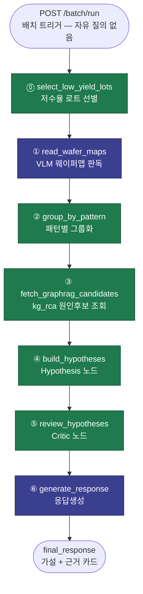
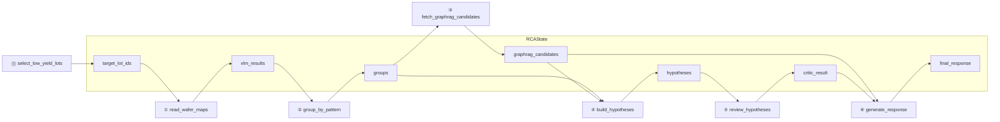
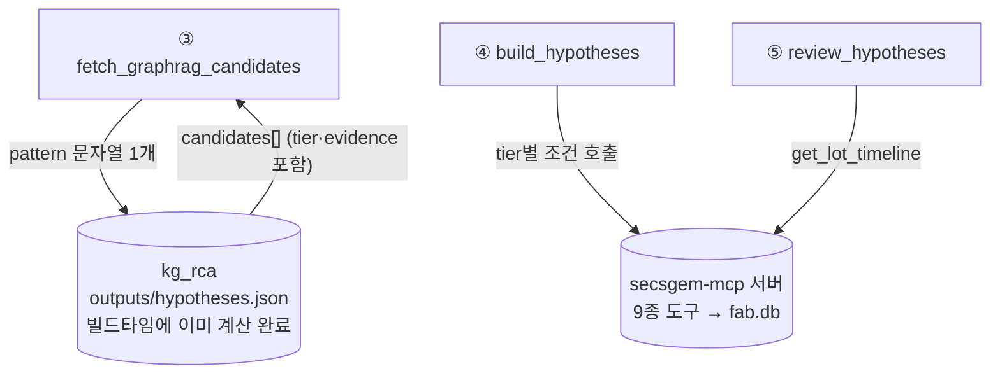
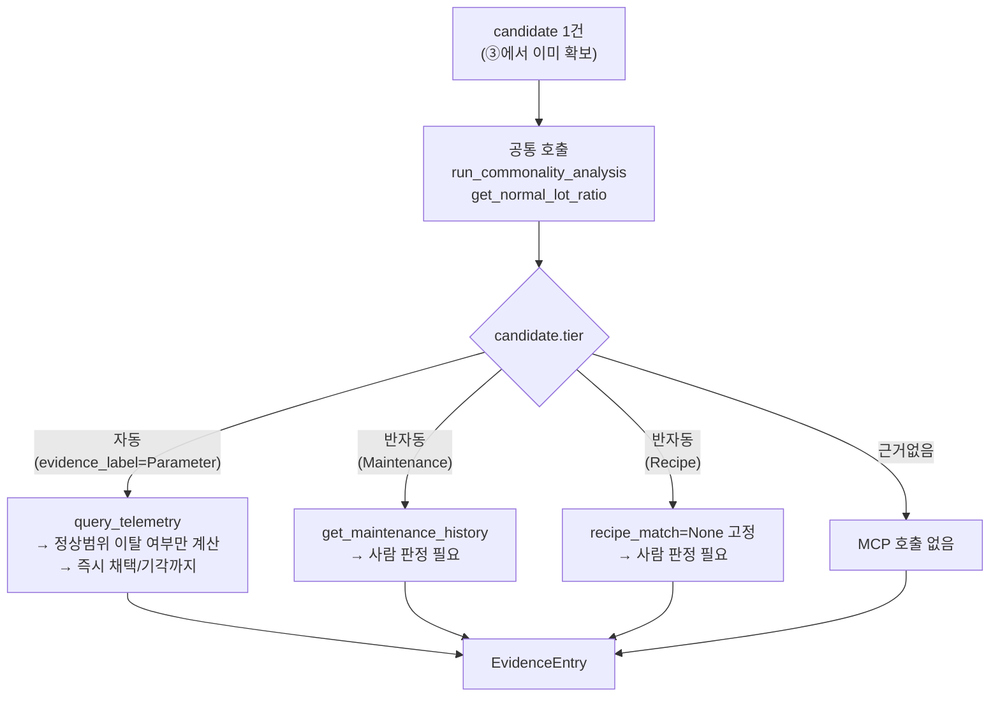
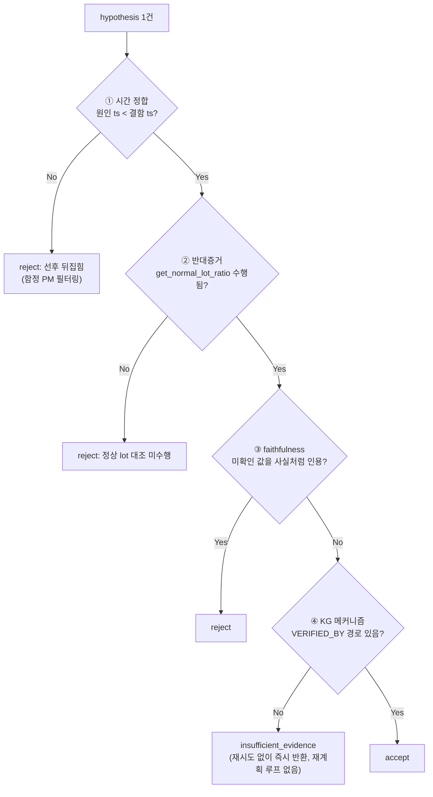

# 서비스 플로우 (0711 작성, 0714 갱신) — `SesacLine_SemiRCA/backend/graph.py` 기준

이 문서는 LangGraph `StateGraph`를 그림으로 옮긴 것이다. 0711 작성 당시엔 코드가 스켈레톤
(대부분 `NotImplementedError`) 상태였지만, 0713에 ⓪~⑥ 전체가 실제로 동작하는 Walking
Skeleton으로 구현되고 0714에 kg_rca 최신본 반영까지 재검증됐다 — 지금은 "노드 구성도"이면서
동시에 "실제로 이렇게 동작한다"는 뜻이기도 하다. 단, ①VLM·⑥응답생성은 여전히 하드코딩/템플릿이고
(진짜 AI 미연동), 4절 Hypothesis 다이어그램의 Recipe 분기는 실제 코드와 다른 부분이 있으니
아래 4절 하단 주석을 참고할 것.

---

## 1. 전체 파이프라인 (⓪~⑥)

**보라(N1·N6)** = 실시간 LLM 호출. **초록(N0·N2·N3·N4·N5)** = 결정적 함수, LLM 없음. 파이프라인 7개 노드 중 5개가 결정적 함수다 — 2026-07-09 노드화 결정 이후 LLM이 실제로 개입하는 지점은 ①과 ⑥ 둘뿐이다.

---

## 2. 노드별로 RCAState의 어느 필드를 쓰고 채우는가

같은 정보를 표로 보면(정본은 `산출물_데이터모델설계.md` §3):

| 노드 | 읽는 필드 | 쓰는 필드 |
| --- | --- | --- |
| ⓪ select_low_yield_lots | `cursor_date` | `target_lot_ids` |
| ① read_wafer_maps | `target_lot_ids` | `vlm_results` |
| ② group_by_pattern | `vlm_results` | `groups` |
| ③ fetch_graphrag_candidates | `groups`(pattern만) | `graphrag_candidates` |
| ④ build_hypotheses | `groups`(lot_ids만), `graphrag_candidates` | `hypotheses` |
| ⑤ review_hypotheses | `hypotheses` | `critic_result` |
| ⑥ generate_response | `critic_result`, `graphrag_candidates`(인용 재사용) | `final_response` |

---

## 3. ③~⑤가 외부 시스템과 어떻게 연결되는가

③은 Neo4j를 매번 다시 쿼리하지 않는다 — `kg_rca`가 3개 고정 패턴(Center/Scratch/Edge-Ring) 전체를 미리 계산해 둔 결과 파일(`kg_rca/outputs/hypotheses.json`)을 패턴으로 필터링만 한다(`backend/graph_client/kg_client.py`).

---

## 4. ④ Hypothesis 노드 내부 — tier가 MCP 호출을 결정한다

> **0714 갱신 — 그림과 실제 코드(`backend/nodes/hypothesis.py`)의 차이 2곳**:
> ① Recipe 분기는 그림처럼 `get_lot_history`를 다시 불러 recipe_id를 비교하지 않는다 — 실제로는
> MCP 호출 자체를 안 하고 `recipe_match=None`을 고정으로 반환한다(조회조차 안 함, 팀 결정 필요
> 사항 중 하나).
> ② `자동` 분기는 그림의 "direction과 비교"와 달리, 후보가 제시한 이탈 방향(`direction`)을 아예
> 보지 않고 "정상범위를 벗어나기만 하면 이상"으로 통일 판정한다(단순화 결정③, `docs/skeleton_kickoff.md`
> §4 스텝3 참고).

---

## 5. ⑤ Critic 노드 내부 — 4개 규칙을 순서대로 통과해야 채택

---

## 6. 참고

- 이 구조가 실제로 무엇을 왜 이렇게 짰는지는 `docs/skeleton_kickoff.md`(용어·순서·팀 결정사항 설명, 가장 자주 갱신됨)와 `docs/semiconductor_proposal.md` §7.1/§7.2(정본 워크플로우 서술)에 있다.
- 코드 원본: `SesacLine_SemiRCA/backend/graph.py`, `backend/nodes/*.py`, `backend/state.py`.
- 그룹 팬아웃은 지금 순차 loop로 짜여 있다(LangGraph `Send` API 아님) — `graph.py`의 `_run_per_group` 참고.