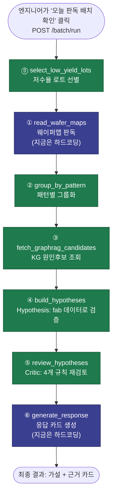
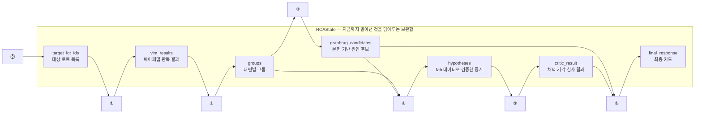
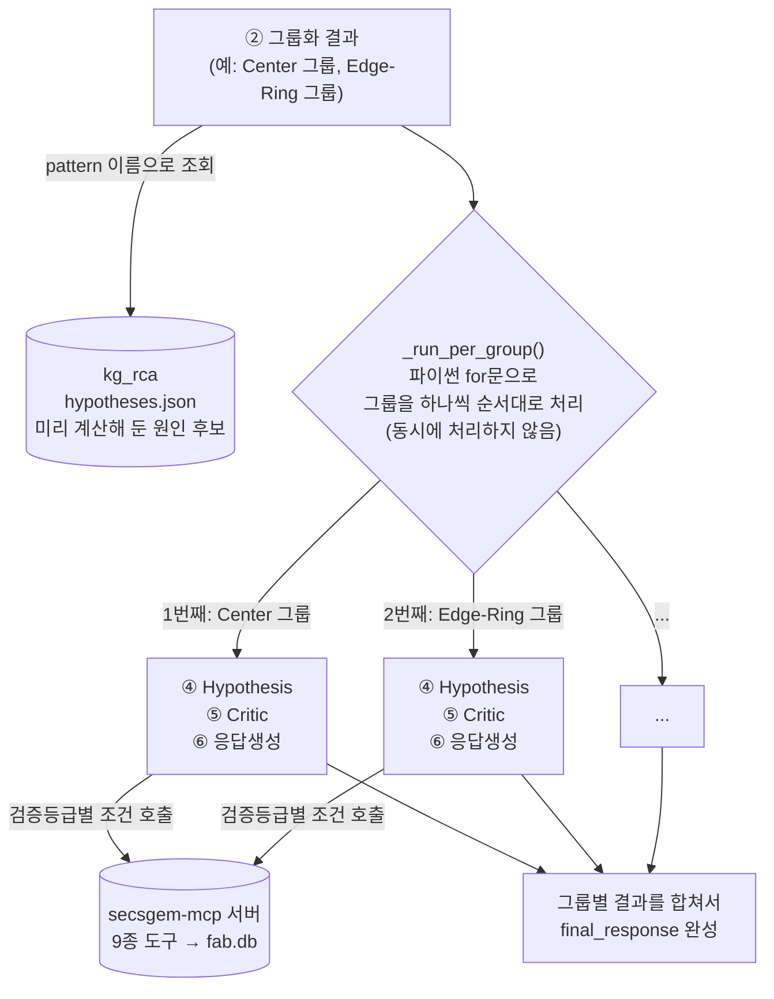

# 스켈레톤 공유 문서 — SesacLine_SemiRCA 백엔드

이 문서는 지금까지 만든 백엔드(⓪~⑥ 파이프라인) 스켈레톤을 팀원들에게 공유하기 위한 정리본이다.
"무엇을 어떻게 만들었는지", "어디가 아직 가짜(하드코딩)인지", "우리가 앞으로 뭘 고쳐야 하는지"를
중심으로 쓴다. 기술적인 용어는 나올 때마다 최대한 풀어서 설명한다.

---

## 1. 한 줄 요약

수율 엔지니어가 "오늘 판독 배치 확인" 버튼을 누르면, 시스템이 자동으로:

1. 어제 수율이 낮았던 로트(생산 배치)를 찾고
2. 그 로트들의 웨이퍼맵을 봐서 어떤 결함 패턴인지 판독하고
3. 같은 패턴끼리 그룹으로 묶고
4. 그 패턴이 문헌상 어떤 원인들로 생기는지 지식그래프(KG팀 산출물)에서 후보를 가져오고
5. 그 후보 하나하나를 **진짜 우리 공장 데이터(가상 시뮬레이션 데이터)**로 검증하고
6. 검증이 믿을만한지 다시 한번 규칙으로 걸러서
7. "이 결함은 이런 원인일 가능성이 높고, 이런 근거가 있습니다" 카드를 만들어준다.

이 7단계(⓪~⑥)를 실제로 코드로 연결해서 **처음부터 끝까지 한 번 돌아가게 만든 것**이 지금까지
작업한 "Walking Skeleton"이다. 다만 이름 그대로 "걸어다니는 정도"의 완성도라서, 일부 단계는
진짜 로직 대신 **임시로 하드코딩(고정값)**을 넣어뒀다. 어디가 진짜고 어디가 가짜인지는 6절에
표로 정리했다.

---

## 2. 전체 구조 — LangGraph와 "오케스트레이션"이 뭔지

### 2.1 LangGraph란

우리 파이프라인은 `LangGraph`라는 라이브러리로 짰다. 개념은 단순하다:

- **노드(node)** = 파이썬 함수 하나. "지금까지의 진행 상황"을 입력받아서, 자기가 할 일을 하고,
  "새로 알아낸 것"을 결과로 돌려준다.
- **상태(state)** = 지금까지 파이프라인이 알아낸 모든 정보를 담은 큰 딕셔너리(자료 보관함).
  노드가 실행될 때마다 이 상태에 새 정보가 쌓인다.
- **엣지(edge)** = "이 노드 다음엔 저 노드를 실행해라"는 화살표. 우리 파이프라인은 분기 없이
  ⓪→①→②→③→④→⑤→⑥ 순서로 일렬로 연결돼 있다(순서도라고 생각하면 된다).
- **StateGraph** = 이 노드들과 화살표를 코드로 등록해서 하나의 실행 가능한 흐름으로 조립하는
  LangGraph의 기능. `backend/graph.py`의 `build_graph()` 함수가 이 조립을 담당한다.

우리 프로젝트에서 "상태"는 `backend/state.py`의 `RCAState`라는 이름으로 정의돼 있다. 아래처럼
파이프라인이 진행될수록 필드가 하나씩 채워지는 구조다(화살표는 "이 정보를 써서 다음 정보를
만든다"는 뜻):

```
target_lot_ids(대상 로트 목록)
    → vlm_results(웨이퍼맵 판독 결과)
    → groups(패턴별 그룹)
    → graphrag_candidates(문헌 기반 원인 후보)
    → hypotheses(fab 데이터로 검증한 증거)
    → critic_result(채택/기각 심사 결과)
    → final_response(최종 카드)
```

각 필드가 정확히 어떤 모양(어떤 키를 가진 딕셔너리인지)인지도 `state.py`에 전부 타입으로
적혀 있다. 이건 "이 정보엔 반드시 이런 항목들이 있어야 한다"는 일종의 서식 양식이라고 보면 된다
— 나중에 필드 이름을 잘못 적는 실수를 파이썬이 미리 잡아준다.

### 2.2 "오케스트레이션"이 실제로 뭘 하는지

하루 배치 안에 결함 패턴 그룹이 여러 개 나올 수 있다(예: Center 그룹, Edge-Ring 그룹이 같은 날
동시에 나올 수 있음). 이 여러 그룹을 어떤 순서/방식으로 처리할지가 "오케스트레이션"이다.

**지금 방식**: `backend/graph.py`의 `_run_per_group()` 함수가 그룹들을 **파이썬 for문으로
하나씩 순서대로** 처리한다. 그룹이 3개면 3번을 순서대로 도는 것이고, 동시에 처리(병렬)하지는
않는다.

**왜 이렇게 했는지**: 하루에 나오는 그룹 수가 많지 않을 거라 예상해서(패턴이 3종류뿐이라
최대 3개), 굳이 복잡한 병렬 처리를 먼저 만들 필요가 없다고 판단했다. LangGraph에는 여러 그룹을
동시에 병렬로 처리하는 기능(`Send API`)도 있는데, 지금은 안 쓰고 있다.

**앞으로 고려할 점**: 그룹 수가 많아지거나(패턴을 9종으로 늘리는 등) 그룹 하나 처리 시간이
길어지면, 이 순차 처리가 병목이 될 수 있다. 이 경우 `graph.py`의 `_run_per_group()` 부분만
병렬 방식으로 바꾸면 된다 — 다른 코드는 안 건드려도 되게 구조를 짜뒀다.

**실제로 겪었던 문제 하나**: `③GraphRAG 조회`, `④Hypothesis 검증`, `⑤Critic 심사`,
`⑥응답생성` 네 노드는 원래 파이썬의 "람다"(한 줄짜리 익명 함수)로 짜여 있었는데, 이 중
Hypothesis·Critic은 내부에서 MCP 서버 호출을 기다려야 해서(`await`가 필요해서) 람다로는 실행
자체가 안 되는 문제가 있었다. 람다는 `await`를 담을 수 없기 때문이다. 그래서 이 네 개를 전부
정식 `async def` 함수로 바꿔서 해결했다. (지금은 이미 고쳐진 상태라 신경 안 써도 되지만, "왜
이렇게 짰는지" 궁금할 수 있어 적어둔다.)

### 2.3 파이프라인이 참고하는 두 개의 외부 데이터 소스

- **kg_rca (지식그래프, KG팀 산출물)**: "이런 결함 패턴이면 문헌상 보통 이런 원인들이
  있더라"는 **일반 지식**을 미리 계산해서 `kg_rca/outputs/hypotheses.json`이라는 파일에 저장해
  둔다. 우리 백엔드는 이 파일을 읽기만 한다(실시간으로 그래프 DB에 질의하지 않음).
- **secsgem-mcp (MCP 서버)**: "이번에 실제로 문제가 된 로트가 어느 장비를 지났고, 그 장비에서
  무슨 일이 있었는지"를 알려주는 **가상의 공장 운영 데이터** 조회 창구. 진짜 공장 데이터가
  없어서 시뮬레이터로 만든 가짜(하지만 그럴듯한) 데이터다. 9개의 조회 함수(툴)를 제공하며,
  자세한 설명은 4절 Hypothesis 부분에서 다룬다.

### 2.4 전체 아키텍처를 그림으로 보면

**그림 1 — 노드 순서(뼈대 구조)**. 위에서 설명한 ⓪~⑥이 실제로 어떤 순서로 연결돼 있는지를
그대로 그림으로 옮긴 것이다. **보라색 2개(①·⑥)만 원래 AI가 실시간으로 글을 쓰거나 판단해야
하는 자리**이고(지금은 하드코딩으로 대체돼 있음), **초록색 5개(⓪②③④⑤)는 전부 "정해진 규칙대로
움직이는" 일반 코드**다. 처음 보면 "AI가 다 하는 파이프라인"처럼 보이기 쉬운데, 실제로는 AI가
관여하는 지점이 두 곳뿐이라는 걸 이 색으로 표현했다.



**그림 2 — 정보가 어떻게 쌓이는지(상태 흐름)**. 2.1절에서 설명한 "상태(state)"가 노드를 하나씩
지날 때마다 실제로 어떻게 채워지는지 보여준다. 화살표를 따라가면 "이 노드가 이 정보를 읽어서,
이 정보를 새로 만든다"는 뜻이다.



**그림 3 — 그룹이 여러 개일 때(오케스트레이션) + 외부 시스템 연결**. 2.2절에서 설명한 "그룹을
순서대로 하나씩 처리한다"는 부분과, ③~⑤ 노드가 kg_rca·secsgem-mcp와 어떻게 연결되는지를 함께
보여준다.



세 그림의 원본 코드는 각각 `backend/graph.py`(전체 조립·그룹 반복 처리), `backend/state.py`
(상태 모양 정의)에 있다.

---

## 3. 노드별 설명 (⓪~⑥)

| 단계 | 노드 이름(함수) | 파일 | 하는 일 | 지금 상태 |
|---|---|---|---|---|
| ⓪ | `select_low_yield_lots` | `nodes/lowyield.py` | 어제 수율이 기준치보다 낮았던 로트를 찾는다 | 실제 로직(SQL 집계). 기준값만 고정 |
| ① | `read_wafer_maps` | `nodes/vlm.py` | 웨이퍼맵 이미지를 보고 결함 패턴을 판독한다 | **완전 하드코딩** — 이미지도 안 읽고 무조건 "Center"라고 응답 |
| ② | `group_by_pattern` | `nodes/grouper.py` | 같은 결함 패턴을 가진 로트끼리 그룹으로 묶는다 | 실제 로직(다수결 방식) |
| ③ | `fetch_graphrag_candidates` | `nodes/graphrag.py` | KG팀 산출물(`hypotheses.json`)에서 이 패턴의 원인 후보를 가져온다 | 실제 로직(파일 조회) |
| ④ | `build_hypotheses` | `nodes/hypothesis.py` | 원인 후보 하나하나를 fab 데이터로 검증해 증거를 모은다 | 실제 로직, 단 3곳 단순화(4절 참고) |
| ⑤ | `review_hypotheses` | `nodes/critic.py` | 모은 증거가 믿을만한지 규칙으로 재검토해 채택/기각 | 실제 로직(4개 규칙) |
| ⑥ | `generate_response` | `nodes/response.py` | 최종 결과를 사람이 읽을 카드 형태로 조립 | **완전 하드코딩** — AI 글쓰기 없이 고정 문장 틀만 채움 |

**LLM(AI가 실시간으로 글을 생성/판단)을 쓰는 노드는 원래 설계상 ①과 ⑥ 둘뿐이다.** ③~⑤는
처음부터 "정해진 규칙대로만 움직이는 함수"로 만들기로 팀에서 결정했다(2026-07-09). 지금은 ①·⑥도
아직 진짜 AI를 안 붙이고 임시값으로 대체해둔 상태다.

---

## 4. Hypothesis 노드(④) 자세히 — `nodes/hypothesis.py`

### 4.1 이 노드가 하는 일

KG팀이 준 원인 후보 하나(예: "Center 패턴은 DEPO 공정의 챔버 압력 이상 때문일 수 있다")마다,
그게 **이번에 실제로 일어난 일과 맞는지** fab 데이터로 확인한다. 확인 방법은 후보마다 다른데,
그 후보에 붙어 있는 **검증등급(tier)**에 따라 정해진다:

| 등급 | 뜻 | 확인 방법 |
|---|---|---|
| `자동` | 센서로 측정되는 값(예: 압력, 온도)과 관련된 원인 | 실제 측정값이 정상범위를 벗어났는지 계산만 하면 답이 나온다 |
| `반자동` | 정비기록이나 레시피(공정 설정값)와 관련된 원인 | 데이터는 조회할 수 있지만, "이게 이 결함과 관련 있는 정비인지"는 사람이 읽고 판단해야 한다 |
| `근거없음` | 문헌에만 나오고 fab 데이터로는 확인할 방법이 없는 원인 | 확인 자체를 시도하지 않는다 |

이 등급 구분에 따라 **어떤 MCP 조회 함수를 부를지가 자동으로 갈린다**:

- **모든 후보 공통으로 항상 부르는 것 2개**:
  - `run_commonality_analysis` — 이번에 결함이 난 로트들이 공통으로 어느 장비를 지났는지 찾는다
    (예: "불량 로트 8개 중 8개 다 DEPO-03을 지났다" → DEPO-03이 용의선상 1순위)
  - `get_normal_lot_ratio` — 그 장비를 지난 **정상** 로트가 얼마나 되는지 확인한다(반대 증거).
    정상 로트도 잔뜩 지나갔다면 그 장비는 범인이 아닐 가능성이 높다는 뜻.
- **등급이 `자동`이면 추가로**: `query_telemetry`로 실제 센서 측정값을 가져와서 정상범위를
  벗어났는지(drift) 계산한다. 이건 사람 판단 없이 시스템이 결론까지 낸다.
- **등급이 `반자동`이고 정비기록 관련이면**: `get_maintenance_history`로 정비 이력을 가져온다
  (판단은 사람 몫으로 남김).
- **등급이 `반자동`이고 레시피 관련이면**: 지금은 조회를 아예 안 하고 "사람이 봐야 함"이라고만
  표시한다(4.3절 참고).
- **등급이 `근거없음`이면**: MCP 호출을 아예 안 한다.

### 4.2 코드 흐름 (함수 3개로 나뉨)

1. `build_hypotheses()` — 이 그룹(예: Center 그룹)의 원인 후보 전체를 순회하면서, 후보마다
   아래 `_verify_unit()`을 호출해 증거를 모으고 최종 리스트를 만든다.
2. `_verify_unit()` — 후보 하나를 검증하는 실제 작업. 위에서 설명한 "공통 2개 + 등급별 추가
   호출"을 실제로 수행한다.
3. `_verify_candidate()` — `_verify_unit` 안에서, 등급별로 어떤 MCP 함수를 부를지 분기하는
   부분만 따로 뗀 함수.

### 4.3 지금 단순화된 부분 3가지 (코드에 `# 결정①/②/③` 주석으로 표시돼 있음)

1. **MCP를 부르는 단위 문제**: 원래는 원인 후보 하나마다 매번 새로 MCP를 호출하려고 했는데,
   실제로 돌려보니 후보가 200개가 넘어가면 **타임아웃**이 났다. 그래서 "공정 + 검증등급 +
   검증신호"가 똑같은 후보는 같은 MCP 결과를 재사용하도록(캐싱) 최소한으로만 고쳤다. 제대로 된
   설계는 아니고 응급처치 수준이라, 나중에 다시 설계가 필요하다.
2. **원인 후보가 특정 공정을 안 짚어준 경우**: 문헌에 따라서는 "어느 공정인지"까지는 안 나오고
   원인만 나오는 경우가 있다. 지금은 이 경우 공정 구분 없이 전체 로트를 뭉뚱그려서 확인하는데,
   그러면 신호가 흐려질 수 있다(용의 장비를 좁히기 어려워짐).
3. **원인 신호가 "이 값이 높아야 이상"인지 "낮아야 이상"인지 문헌에 안 나온 경우**: 지금은
   방향 상관없이 "정상범위를 벗어나기만 하면 이상"으로 통일해서 처리한다. 해당하는 경우가
   몇 건 안 돼서(전체 대비 소수) 지금 규모에선 영향이 크지 않다.

### 4.4 그 외 알아두면 좋은 부분

- 레시피(공정 설정값) 관련 후보는 지금 **조회 자체를 안 하고** "사람 판정 필요"라고만
  표시한다. 실제로는 최소한 이번에 어떤 설정값이 쓰였는지는 보여줄 수 있어야 하는데, 아직
  안 만들어져 있다.
- 정비기록 관련 후보는 "그 시간대에 정비기록이 있었는지"만 확인하고, **그 정비 내용이 진짜
  이 결함과 관련 있는 내용인지는 전혀 확인 안 한다**(정비 기록은 자유 텍스트라서 사람이
  읽어야 하는 부분인데, 최소한의 키워드 매칭도 아직 없음).
- 알람(경보) 데이터는 이 노드에서 아예 안 쓴다 — Critic 쪽에서 쓰는 게 맞다고 판단해서 뒀다
  (5절 참고).
- 그룹의 "검증 시간창"(언제부터 언제까지의 데이터를 볼지)을 정할 때, 그룹에 로트가 여러 개
  있어도 **첫 번째 로트 하나만** 기준으로 삼는다. 그룹 전체를 고려하는 방식으로 바꿀 필요가
  있다.

---

## 5. Critic 노드(⑤) 자세히 — `nodes/critic.py`

### 5.1 이 노드가 하는 일

Hypothesis 노드가 모아온 증거들을 보고, "이 증거가 정말 믿을만한가"를 4개의 규칙으로
순서대로 검사한다. 하나라도 걸리면 그 자리에서 기각하고, 4개를 다 통과해야 채택된다. 재시도는
없다 — 통과 못 하면 바로 다음 판정으로 넘어간다.

| 순서 | 규칙 이름 | 확인하는 것 | 실패하면 |
|---|---|---|---|
| ① | 시간 정합 | "원인이 됐다는 사건(예: 정비)이 결함 발생보다 먼저 일어났는가?" — 결함이 이미 난 다음에 한 정비를 원인으로 우기면 안 되므로 | 기각("선후 뒤집힘") |
| ② | 반대증거 확인 | Hypothesis 단계에서 "정상 로트 비율"을 실제로 조회했는가? | 기각("반대증거 미수행") |
| ③ | Faithfulness(근거 정합) | 확인이 안 된 값을 마치 확인된 것처럼 우기고 있지는 않은가? | 기각("faithfulness 위반") |
| ④ | KG 메커니즘 연결 | 애초에 fab 데이터로 확인 가능한 근거가 있는 원인인가(`근거없음` 등급이 아닌가)? | "판단 불가"(기각과는 다른 상태) |

### 5.2 각 규칙이 실제로 어떻게 동작하는지

- **① 시간 정합**: `get_lot_timeline`(MCP 도구)으로 이 로트의 전체 이벤트 타임라인을 가져와서,
  "결함이 확정된 시점(웨이퍼 테스트 시점)"과 "원인으로 지목된 정비 시점"을 비교한다. 정비가
  더 나중이면 앞뒤가 바뀐 것이므로 기각한다. 단,애초에 정비 시각 정보가 없는 후보(예: `자동`
  등급처럼 센서값으로 판정하는 경우)는 이 검사 대상이 아니라서 그냥 통과시킨다 — 이 규칙은
  원래 "결함 이후에 한 정비를 원인으로 착각하는 함정"을 걸러내려는 목적이기 때문이다.
- **② 반대증거 확인**: Hypothesis 단계에서 "정상 로트 비율" 값을 아예 못 구했으면(조회 자체가
  안 됐으면) 기각한다.
- **③ Faithfulness**: 지금은 아주 단순하게만 구현돼 있다 — `자동` 등급인데 정상범위 자체가
  없어서 이탈 여부를 판정 못 한 경우만 위반으로 본다. 진짜 의미의 "생성된 문장이 실제 조회
  값과 맞는지" 검사는, ⑥번 응답생성이 진짜 AI 문장을 만들게 된 다음에야 제대로 만들 수 있다
  (지금은 ⑥이 고정 문장이라 검사할 "문장"이 사실상 없음).
- **④ KG 메커니즘 연결**: `근거없음` 등급이면 fab 데이터로 확인할 방법 자체가 없다는 뜻이므로,
  기각이 아니라 "판단 불가"로 별도 처리한다(사람이 볼 근거가 아예 없다는 뜻이라 기각과는
  성격이 다르다).

### 5.3 지금 안 하고 있는 것 (앞으로 필요할 수 있는 것)

- 그룹에 로트가 여러 개 있어도 **첫 번째 로트만** 시간 정합 검사에 쓴다(Hypothesis와 같은
  단순화).
- 알람(경보) 데이터를 전혀 안 쓴다. "결함이 난 시점 근처에 알람이 있었는가"를 추가 확인용으로
  쓸 수 있는데, 아직 안 붙어 있다. 다만 지금 가상 데이터에서는 알람 대부분이 배경 잡음으로
  설계돼 있어서, 붙이더라도 "지지 증거"보다는 "혹시 교란 아닌지 의심하는 용도"로 쓰는 게
  맞을 것 같다.
- 4개 규칙 모두 통과하면 그냥 다 똑같이 "채택"이다 — 그 중에서도 "이게 더 확실하다/덜
  확실하다" 같은 순위나 점수는 없다. 나중에 채택된 가설이 너무 많아지면 순위 매기는 기능이
  필요해질 수 있다.

---

## 6. 지금 하드코딩(가짜/고정값)된 부분 전체 목록

| 위치(파일) | 지금 어떻게 돼있나 | 왜 문제가 될 수 있나 |
|---|---|---|
| `nodes/vlm.py` | 웨이퍼맵 이미지를 실제로 안 읽고, 무조건 패턴을 "Center"로 고정 응답 | 이 파이프라인에서 가장 크게 비어있는 부분. 실제 AI 모델(VLM) 연동이 필요 |
| `nodes/response.py` | AI 글쓰기 없이, 미리 정해둔 문장 틀에 값만 끼워 넣음 (`"- {원인} (등급: {등급}, 의심 장비: {장비})"` 식) | 사람이 읽기엔 딱딱하고, 왜 이 원인이 의심되는지에 대한 자연스러운 설명이 없음 |
| `nodes/lowyield.py` | "수율이 몇 %보다 낮으면 저수율"의 기준값을 0.8로 고정 | 이 기준이 적절한지 데이터 기반 검토가 안 됨(예: 평균 대비 표준편차 방식 등 고려 가능) |
| `nodes/grouper.py` | 그룹으로 묶을 때 "최소 몇 개 로트가 있어야 그룹으로 인정할지" 기준이 없음(1개짜리 그룹도 통과) | 로트 1개짜리 그룹은 통계적으로 신뢰하기 어려울 수 있음 |
| `main.py` | 배치를 처음 실행하는 기준 날짜(`2026-03-04`)를 고정값으로 박아둠 | 실제 서비스에서 "언제부터 배치를 시작할지" 정책이 아직 없음 |
| `hypothesis.py` (전체) | 4절에서 설명한 3가지 단순화(캐싱 방식, 공정 미지정 처리, 방향 무시) | 정확도에 영향을 줄 수 있는 임시 처리들 |

---

## 7. 우리가 수정/재검토해야 할 사항 (파일별 정리)

### 7.1 `nodes/vlm.py` — 웨이퍼맵 판독 (가장 시급)

- 실제 AI 모델(VLM) 연동 필요. 지금은 결함 패턴 이름 하나 말고는 아무것도 안 만든다.
- 실제로는 결함 패턴뿐 아니라 위치·설명·심각도·확신도 등 여러 정보를 함께 만들어야 하는데,
  지금은 전부 고정값이다.
- 실제 이미지를 가져오는 조회 함수(`get_wafer_map`)조차 지금은 안 쓰고 있다 — 이미지를 한
  번도 실제로 읽지 않는다는 뜻.

### 7.2 `nodes/hypothesis.py` — 증거 수집 (4절 참고)

- MCP 호출 캐싱을 응급처치 수준에서 제대로 된 설계로 바꾸기.
- 공정을 특정 못 하는 후보 처리 방식 재검토.
- 정비기록이 진짜 이 결함과 관련 있는지 확인하는 로직(최소 키워드 매칭이라도) 추가.
- 레시피 관련 후보도 최소한 조회는 하도록 보완.
- "의심 장비"를 정할 때 지금은 1등 후보를 조건 없이 그냥 채택하는데, 비율이 너무 낮으면(예:
  30% 미만) "특정 실패"로 처리하는 하한선 추가 검토.

### 7.3 `nodes/critic.py` — 검증 (5절 참고)

- 시간 정합 검사가 `자동` 등급(센서값 기반) 후보에는 사실상 적용이 안 되고 있다 — 이 부분도
  검사할 방법 마련 필요.
- Faithfulness 검사는 ⑥ 응답생성이 실제 AI 문장을 쓰게 된 다음에 제대로 재설계 필요.
- 알람 데이터를 보조 확인용으로 추가할지 검토.

### 7.4 `nodes/response.py` — 응답 생성

- 실제 AI로 자연스러운 문장을 만들도록 교체 필요.
- 지금은 KG팀이 만들어준 "이 원인이 왜 의심되는지"에 대한 문장과 출처(문헌 인용)를 파이프라인
  중간에서 버리고 있다 — 최종 카드에 "왜 이 원인인지" 근거를 보여주려면 이 정보를 살려서
  옮기는 작업이 필요하다.

### 7.5 `nodes/lowyield.py` / `nodes/grouper.py`

- 저수율 판단 기준값을 고정값 대신 데이터 기반으로 정할지 검토.
- 그룹 최소 로트 수 기준(게이트) 추가 여부 검토.

### 7.6 `main.py`

- 배치 시작 날짜 정책 정하기.
- 지금 서버를 직접 켜서(`uvicorn`) 실제 웹 요청으로 확인해본 적이 아직 없다 — 코드를 직접
  호출해서만 확인했다. 실제로 서버를 띄운 상태에서의 동작 확인이 필요하다.

### 7.7 아직 실제로 테스트 안 해본 상황들

- 결함 패턴이 우리가 아는 3종(Center/Edge-Ring/Scratch)이 아닌 경우("원인 분석 데이터 없음"
  카드가 나가야 함) — 코드는 있지만 실제로 이 상황을 겪어본 적이 없다.
- 원인 후보는 있었는데 Critic이 전부 기각해서 "판단 불가"가 나가는 경우 — 이것도 코드는
  있지만 실제로는 아직 확인 안 됨.

---

## 8. 최근 발견된 이슈 — KG팀 최신 자료 반영 관련

KG팀이 최근 넘겨준 최신 산출물을 반영하는 과정에서 두 가지를 확인·수정했다:

1. **KG팀 산출물(`hypotheses.json`)의 데이터 형태가 일부 바뀌어서, 그걸 읽어오는 코드
   (`graph_client/kg_client.py`)가 새 형태를 못 읽고 에러가 나는 상태였다.** 발견 즉시
   수정했고, 지금은 정상 동작한다(실제로 파이프라인을 처음부터 끝까지 다시 돌려서 확인함).
2. **KG팀은 `pad_usage_hours`(CMP 공정 패드 사용 시간)라는 값이 우리 가상 공장 데이터에
   이미 있다고 보고 있는데, 실제로 확인해보니 아직 없다.** 이 값과 관련된 원인 후보는 지금
   상태로는 "센서로 확인 가능"이라고 표시는 되지만 실제로 확인은 안 되는(에러는 안 나고
   그냥 "확인 불가"로 조용히 빠지는) 상태다. KG팀·시뮬레이터 담당자와 확인이 필요하다.

---

## 9. 팀에서 같이 결정해야 할 것들 (질문 목록)

지금까지 나온 것 중 팀 회의에서 다뤄야 할 것들을 모았다.

1. **MCP 호출 방식**: 원인 후보 하나마다 부를지, 지금처럼 캐싱해서 부를지 — 규모가 커질수록
   중요해지는 결정이다.
2. **공정을 특정 못 하는 원인 후보**를 어떻게 처리할지(전체 공정 뭉뚱그려 확인 / 아예 확인
   생략 / 처음부터 범위에서 제외).
3. **정비기록이 실제로 결함과 관련 있는지** 어떻게 판단할지(키워드 매칭 정도로 충분한지,
   더 정교한 방법이 필요한지).
4. **결과를 저장할 때 원인 후보를 어떻게 구분(식별)할지** — 지금은 그날의 결과를 통째로
   저장만 해서 아직 필요 없었지만, "어제 그 원인이 오늘도 똑같이 나왔나" 같은 비교 기능이
   생기면 필요해진다.
5. **저수율 판단 기준, 그룹 최소 로트 수 기준**을 고정값 대신 어떻게 정할지.
6. **`pad_usage_hours` 관련 데이터 정합성**(8절) — KG팀·시뮬레이터 담당자와 맞춰야 함.
7. **VLM(웨이퍼맵 판독 AI) 연동 우선순위** — 지금 가장 크게 비어있는 부분이라, 언제·어떻게
   붙일지 팀 일정 논의가 필요.
8. **배치를 얼마나 자주 실행할지, 하루에 같은 배치를 여러 번 실행하면 어떻게 처리할지** 등
   운영 방식에 대한 결정도 아직 안 돼 있다.

---

## 10. 다음에 하면 좋을 것 (제안)

1. 서버를 실제로 띄운 상태(`uvicorn`)에서 웹 요청으로 한 번 확인해보기 — 지금까지는 코드를
   직접 호출해서만 확인했다.
2. 결함 패턴이 3종 밖인 경우, Critic이 전부 기각하는 경우를 일부러 만들어서 "판단 불가"·
   "원인 분석 데이터 없음" 카드가 잘 나오는지 확인하기.
3. 9절의 팀 결정 사항들을 하나씩 정리해서, 우선순위를 정하고 담당을 나누기.
4. VLM 연동을 언제 시작할지, 그전까지는 지금의 하드코딩 상태로 다른 부분(예: 프론트엔드
   연동)을 먼저 진행할지 논의하기.
